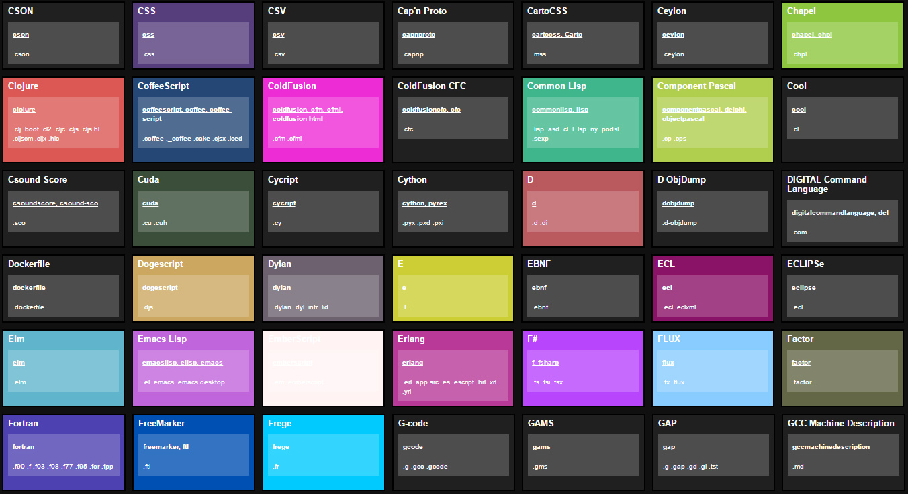

GitHub Syntax Highlighting CheatSheet
=====================================

Static Page Generator which displays all supported languages of [linguist](https://github.com/github/linguist) 

Datasource: [/github/linguist/master/lib/linguist/languages.yml](https://raw.githubusercontent.com/github/linguist/master/lib/linguist/languages.yml)

[](https://andidittrich.github.io/GitHubSyntaxHighlighting/)

## Build/Generator ##
To update the list, just run the generator. The `index.html` file is automatically generated using the latest [linguist data](https://raw.githubusercontent.com/github/linguist/master/lib/linguist/languages.yml)

```bash
node generator.js
```

## License ##
GitHubSyntaxHighlighting is OpenSource and licensed under the Terms of [The MIT License (X11)](http://opensource.org/licenses/MIT) - your're welcome to contribute